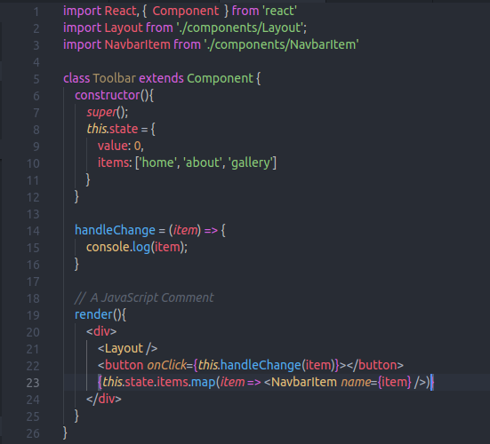
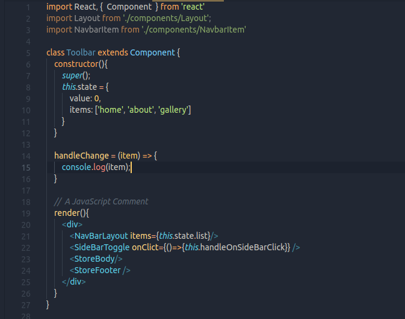
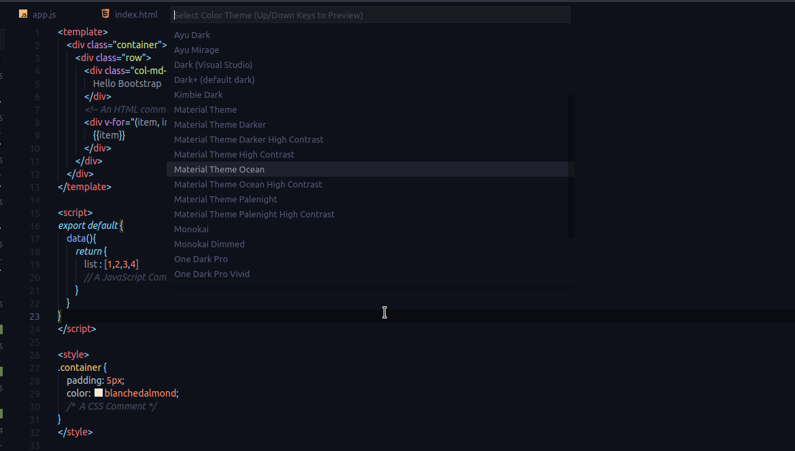
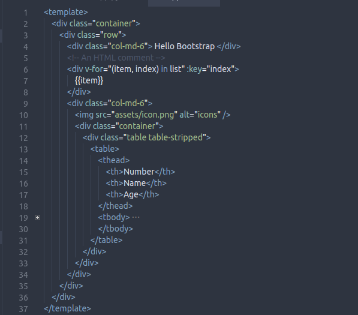

In this section we are going to take a look at how to make vscode visually awesome.
<!-- more -->

This is just another part of my previous post called 'Best VSCode extensions for productivity' in which I covered only the development related extensions. In this section we will look at how to make VSCode visually more attractive.

code comes with a few themes already installed in it. Some of them are quite good, but I don't like the others, like 'Red' or 'High Contrast'. I mean what was the developer thinking while designing that Red theme? "Let's put Red everywhere, Devs will love it!". Dude! I think twice before talking with someone who uses light themes. I don't know what kind of monsters they will turn into And you brought the Red one here? Absolutely Barbaric. That's why, if you are NOT O.K. with the default themes like Dark+ or Solarized or, If you still want to check them out Here are some of the themes I have used till today:

### [One Dark Pro](https://marketplace.visualstudio.com/items?itemName=zhuangtongfa.Material-theme)

If you are coming from the Atom editor background, This theme will make you feel like returning home again. It is inspired by Atom's well known dark theme. One Dark Pro goes really well with small screen devices and it is one of the most downloaded theme from vscode marketplace. If you are not okay with the default colors, it also lets you override few settings like tab color, sidebar color etc.

### [Ayu](https://marketplace.visualstudio.com/items?itemName=faceair.ayu-one-dark)

Ayu is a decent theme originated from One Dark Pro itself. Ayu is my favourite choice while working on React apps especially. The JSX tags with Ayu looks particularly vibrant to me and they are distinguishable from one another. There is not much difference between Ayu and One Dark besides color schemes, but hey, that's all the `theming` means. changing the color patterns :smile:

### [Material Theme](https://marketplace.visualstudio.com/items?itemName=Equinusocio.vsc-material-theme)

Material theme extension pack provides a set of multiple themes with material accent. There are around 10 themes in Both dark and Light formats, but Light themes are useless, so let's consider only dark ones. The dark material themes are really good with brightness settings and they are much more customizable. The only problem with Material theme I face it, I kind of don't like the themes that do not show a tabs separator for open files. it gets confusing when there are more than 10+ files are open at the same time. But again, these settings are configurable. Material theme is, as usual, plays much better with Material Icons, if you are looking for a full Material UI kind of experience, do check out [material icons](https://marketplace.visualstudio.com/items?itemName=PKief.material-icon-theme) theme as well 

### [Nord](https://marketplace.visualstudio.com/items?itemName=arcticicestudio.nord-visual-studio-code)

If you have ever been into Linux ricing for too long, there is no way you have not heard of the famous nord color scheme. Even I did not know about the nord vscode extension. Nord is the color-scheme I use for my `xfce4-terminal` and I really like it. So one day I casually searched for nord colorscheme for vscode too and fortunatly, found it on marketplace. Nord color scheme targets not to be much vibrant like the all other themes I mentioned before. Other themes try to distinguish the content based on contrast colors like white on black etc., while nord tries to differentiate between them with the same tone of colors, which looks absolutely beautiful for the end user (which is a developer again!).  Even with the same tone, the background, the code and the comments too, do not get mixed up ever. If you are not into vibrant themes, I'd suggest you to check this one out. You won't be disappointed!  :notes:.