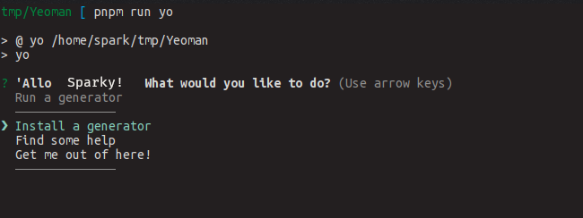

Everytime we start with a new web project, no matter what framework, we face some repeated code that we can avoid as a boilerplate.

<!-- more -->

Even though famous UI frameworks/Libraries like React, Vue.js or Angular come with a command like utility that can generate a starting point for us for our new project, many times I have observed myself deleting the most of the code generated by such tools. Like I create a new project with `create-react-app {new-awesome-project-that-I'm-not-gonna-finish}` and usually I delete the default, Component `<App/>`, the style and the test file with it. Same thing happens with vue-cli. So in the conclusion, the boilerplate generated by these command line tools is most of the time useless besides some webpack configuration files and pre-installed scripts etc.

Well, for another case, What If I don't want the default folder structure given by these tools? What if I want some other test runner? What if I want the project to be generated with the combination of angular + bootstrap + gulp + d3? Not even google is going to spend a single minute on developing such scaffolding projects with each type of permutation and combination. So what is the answer here? Do I write all this configuration each time I am starting a new project with similar requirement? Or do I just copy it from my previous project? Both of them are not the answers!

Meet, <strong>Yeoman</strong> - The web's scaffolding tool for modern webapps :tada:

## What is scaffolding

The term `Scaffolding` comes from buildings and construction. Scaffolding is a temporary base structure used by workers to repair or build the site. Same way, while the developers are creating a website, scaffolding points to some base architecture or some technology stack or even a file structure that is being used (may or may not be temporarily). If you have used vetur on vscode, you can see scaffolding in action by creating an empty `.vue` file, and just pressing `ctrl + space` to generate the base structure of vue file which is `template-script-style`. This is scaffolding on file level. Tools like `create-react-app` or `vue-cli` deals with project level scaffolding, i.e. they give you multiple files with code auto generated in them.

## Yeoman

Yeoman presents you with a very easy concept, developers write `plugins` or `generators` which is like a base structure for your technology stack, and publish them. you browse these kind of already created boilerplate projects like you browse for apps on app/play store, and choose the one which you think is the best based on it's description, or votes etc and install it via yeoman's official command line tool `yo` :metal: and you'll have the project structure described in that plugin or `generator` on your disk. Easy as hell isn't it? The best part is Yeoman does not take any decision with the generated codebase, the whole control is with the plugin you are using. So if you ever want to make any changes to the generator, You can just make a PR to the original generator or even make your own generator and you'll have your 'Personal' project structure forever. Let's see it in action.

### Installation
You know the drill, use as usual `npm` to install yeoman CLI, use `-g` to install it globally and blah blah blah..

```bash
[sudo] npm install -g yo
```

This is enough to run `yo` from command line. Now go to your terminal and just run `yo` (check if you have installed it globally or locally, you may need appropriate npm script for that)



At this point, if you click on `install a generator` option, `yo` let's you search for a genator and even install it from command line only. This is not the usual way I have used it though. I like to search from the list given at their official [site](http://yeoman.io/generators/). generators are named with `generator-{}` format, so if you want to install `webapp` generator, you'd need to run 
```bash
[sudo] npm install -g generator-webapp
```

and now you are ready to scaffold your webapp project with
```bash
yo webapp
```

A nice thing with generators is most of them are designed to give you flexibility while scaffolding. It's same as when you create a new vuejs project with vue-cli. The questions may include `Which test runner to choose` and `Which style processor to use Sass or less` etc.

Generators not only create the entire projects but also add functionality later like adding new controllers to angular app etc. These type of generators are called subgenerator. Take an example of `cg-angular` generator. Even after scaffolding the entire project, you can add new directive to the project by just 
```bash 
yo cg-angular:directive new-directive
```
There's much more to yo than just installing generators like creating your own generator, testing and debugging it, publishing it etc. Try this awesome tool on your own and do let me know what do you feel on [telegram](http://t.me/Sparkenstein)