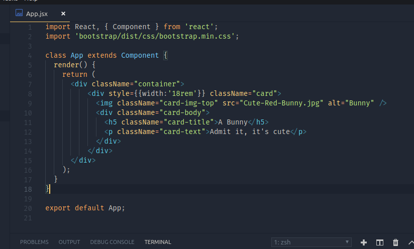

When we talk about UI Frameworks or Libraries, Three big giants stand in front of us. You know whom I am talking about

<!-- more -->

You guessed it! `Angular`, `React` and `Vue.js`. All these Frameworks/Libraries have their `unique` syntax of writing code. All of them try to 'force' Some type of coding standards or styles on developers that's why they are more famous than the other frameworks in the market. People like to do the things differently. Angular introduces us with unique TypeScript Syntax with a nice clean project structure. Although I am not a big fan of angular, following the 'Angular Way' surely helps in maintaining the code in the long run. Vue introduced us with a more cleaner way of writing components where each component will have its own structure, separating each component's HTML, JavaScript and Styles from one another. And this syntax is extremely easy to learn, read, change etc. Now, I have been mentioning the words 'Frameworks/Libraries' even though I am talking about just three tools here. There is a reason for that. Vue.js and Angular are 'frameworks' They tend to keep the control to themselves. They `call` our code in contrast to react. React is a library and not a framework. React doesn't really care if we are using it throughout the project or using it just for a part of it. React does not keep the controll to itself, instead react tells us to 'Do whatever you want in your JS and I will try to handle it'. Is it getting confusing? Well don't worry first of all, this is not a post about Frameworks vs Libraries, and second, at the end of this post, I will still try to make you understand what react is and how it is different from other frameworks or libraries. We are also going to take a look at what is JSX and babel etc. 

## The 'Reactive' way of writing the code

As other frameworks, react also has it's own unique way of writing the code. If you haven't already seen it, it's called JSX or JavaScript-XML. At the first glance, it looks like VERY weird way of writing JavaScript. But believe me, it's not. Infact, JSX kinda actully makes more sense when you understand what is going on behind the curtains. Here is how jsx syntax looks like if you are not familier with it:



The Code execution starts from main react module. 'React' is responsible for converting this wierd looking code into something that actully makes sense for the JavaScript. Each JSX tag represents a `React.createElement()` method automatically. Consider following syntax:
```jsx
const header = <h2>Hello Header</h2>;
```
Look carefully, the value of `header` variable is NOT a string. it's literally a HTML syntaxt. This block of code when parsed from something that can understand JSX, get's compiled down to this:
```js
const header = React.createElement('h2', null, 'Hello Header');
```
Now it makes sense as a JavaScript. If you still haven't understood, consider following simple nested elements example:
```jsx
  const page = <h2> Header <p> Paragraph! </p> </h2>;
```
Will compile down to:
```js
const page = React.createElement("h2", null, "Header", React.createElement("p", null, "Paragraph!"), "");
```
Let's agree on this is not some Futuristic thing to be afraid of. This is just a `createElement` method that takes variable number of arguments to create elements on the DOM. And JSX is just a syntactic sugar to represent this whole code block given above. Writing nested `React.createElement`s can lead to worst code readability ever you can see above. But when the same thing is written in JSX, it becomes much more readable.

Like Pure HTML, JSX also supports attributes
```jsx
const user = <h1 className="userGreetings"> Hello Tom. <p timeOfDay="morning"> Good Morning! </p></h1>
```
which will be same as
```js
var user = React.createElement("h1", { className: "userGreetings" }, "Hello Tom.",
              React.createElement("p", { timeOfDay: "morning" }, "Good Morning!"));
```

## It's just JavaScript
Now if you have understood the what actully JSX means, let me introduce you with the powet it holds and why it's so much popular. 

You know that writing `<p> ... <p>` Will actully render a Paragraph tag on DOM. Guess what do you have to do If you want to render a list? 
That's correct. you just write `<ul><li>List 1</li></ul>` Take a guess How do you print this list 5 times?

EXACTLY. this is nothing but JavaScript. So like any other JavaScript function, you can just put it under a `for-loop` :grinning:

```jsx
<ul>
  for(let i=0; i<5; i++){
    <li> List {i} </li>
  }
</ul>
```

Getting interesting isn't it? That's not where it stops. You can also create your own tags. Same as angularjs directives or Vue.js components. Now A custom tag/component/directive is nothing but a common structure of build in HTML tags right? For the very basic demo, you can create your own tags like by just defining a function with the same name. There is however one condition though. The function MUST return a JSX element (or `React.createElement` whatever you prefer). Like:
```jsx
function Greetings(){
    return <h2>Good morning</h2>;
}
```
and now you can use `<Greetings>` in your page as it is. PS: React actully prefers to keep the function name and Tag name Capitalized.
```js
<h1> Hello user, <Greetings /></h1>
```

Now to my final topic. I said earlier, that react is not a framework but a library. This react syntax we discussed is the reason why react does not need to be a framework. If you have a `large` project you want to migrate to react, migrating everything at once is not the answer. I mean you can do that but that's really not necessary. The react components are dynamic in nature and plays well with most other libraries. I mean it's just JavaScript what else flexibility do you want? You can just take a small part of your project, convert it to a react component, and then just go on building other things as you please. Now how to do that is not really a part of this discussion as the post says 'Not Another React tutorial'. I just wanted to let you know that react is not wierd, it's infact much simpler and easy to use than most other UI frameworks out there. Play with it, and DO let me know what do you think of this post on [telegram](http://t.me/Sparkenstein).
