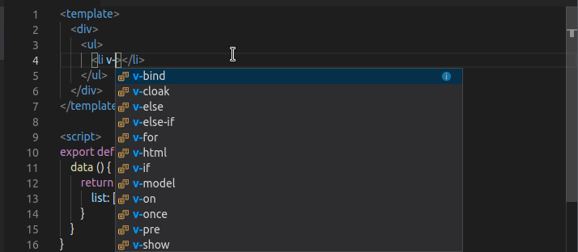
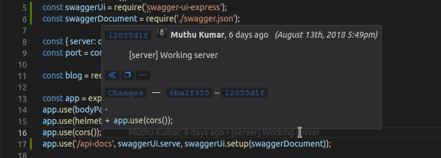
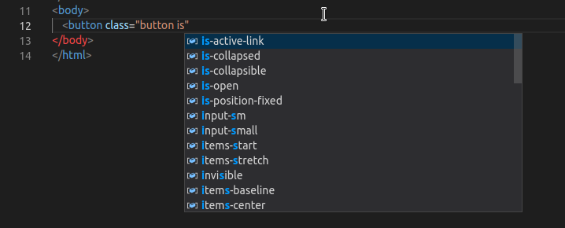
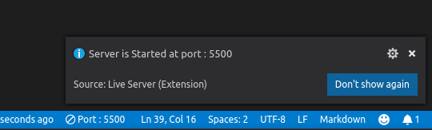
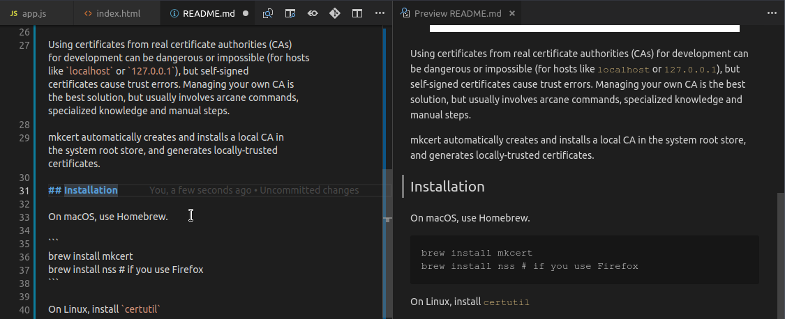

As a JavaScript developer, I primarily depend on Visual Studio Code i.e. VSCode for writing my code.
<!-- more -->

No matter how much I dislike Microsoft for being closed source and all, their few products like vscode and TypeScripts are few of my favourite (of course they are open-sourced :smile:). code's intellisense is quite amazing when you are working with Typed systems like TS. The main feature why VSCode became so popular is it's extension system. It's based on JavaScript/TypeScript. as a result, almost anyone with basic knowlede of JavaScript/TypeScript can make his own extension and even publish it on extension marketplace also. I am going to cover how to create a vscode extension in easiest way in my next post. But till enjoy this list of awesome vscode extensions that I use in my daily life. 

::: tip Note
I am not going to cover themes and color schemes in this post. fot themes and color schemes visit [this post](./themes/)
:::

### [Vetur](https://marketplace.visualstudio.com/items?itemName=octref.vetur)

If you are a Vue.js developer, there is no chance that you have not heard of this extension. Vetur is like all in one tooling for Vue developers. It provides scaffolding, Syntax highlighting, Vue specific code snippets and much more. Vetur is a one of a kind extension, And I don't know much react or angular, but I have not seen a dedicated extension which can do multiple things like Vetur for other frameworks. I maybe wrong though, But when I install a new instance on VSCode, Vetur is the first extension I seek for. Vetur has over 4.48 million downloads on the marketplace, and has been #1 choice for vue developers always.

### [GitLens](https://marketplace.visualstudio.com/items?itemName=eamodio.gitlens)

Now there is a lot of debate about the usefulness of this extension, But I find this one extension helpful a lot. The gitlens comes with the multiple features for git packed into one package. The most useful one I find is instant git blame logs. Now, if you are running low on RAM, I'd suggest not using this feature because as soon as you shift your focus from one line to another, it shows you who is responsible for the mess on that line :stuck_out_tongue:. So like it fires a `git blame -L {lineNumber}` for your each focus shift. Another cool feature of this extension is it adds a heatmap near the line numbers bar where you can see the difference between previous commit and current changes, the heatmap represents different color for different changes like, green bar means the code block is newly added, blue means there are some uncommitted changes in the current code, red mean we have deleted some of the code block etc. The best part is you can just click on these heatmap bars and check what is actully changed from previous commit, so you don't have to take git log every time.

### [CSS Peek](https://marketplace.visualstudio.com/items?itemName=pranaygp.vscode-css-peek) & [IntelliSense for CSS class names in HTML](https://marketplace.visualstudio.com/items?itemName=Zignd.html-css-class-completion)

CSS Peek is inspired from `Go To Definition` feature of multiple IDEs. It's like when we want to see the type of (Class of) some object, so we `ctrl + click` on that object and IDE takes us to the definition of that object. CSS peek works the same magic, but on CSS classes. Sometimes we write classes and forget which class does what. Or even If we remember what it does, we can't keep it's every CSS rule in mind. So we have to go to that rule in our CSS file to check it. Instead, if you have this extension installed, you can just `ctrl + click` on your class in your HTML file, and it will show you the preview of that class, not only that, you can also open the respective css file and traverse to that CSS rule just by your keyboard shortcut :tada:

Another cool extension for CSS development is IntelliSense for CSS. For a large project, we have many Style Sheets embedded into our projects. Let them be frameworks like Bootstrap or your custom CSS files. To get the reference of each class you have to visit their docs each time. This extension crawls our Style sheets and make the classes available for IntelliSense, i.e. `ctrl + space` or `autocompletion` feature will now know what CSS classes you have written in your stylesheets. This extension not only works with local files, but also http CDN links :relieved:

### [Live server](https://marketplace.visualstudio.com/items?itemName=ritwickdey.LiveServer)

Live server is a utility that we all web-developers always use. Tools like webpack ship with a live development server built-in which is kinda really helpful. Now what is a need to live server,  you may ask? Well, there are many benefits of a live server like to test CDN links, request headers, responses, etc. Another benifit is a Cross-Platform testing. You can easily browse a local file on the same PC which is being developed on, but in case you need to test the site on a real life device like a cell phone or iPad etc. You definitely need a server, and setting up full fledged servers like httpd is kind of a headache just for testing purpose. Live server extension will open a port (default to `5500`) on your system which you can browse from any device (may need some configuration before accessing directly). 

### [Markdown All in One](https://marketplace.visualstudio.com/items?itemName=yzhang.markdown-all-in-one) & [Markdown PDF](https://marketplace.visualstudio.com/items?itemName=yzane.markdown-pdf)

I work with markdown files A LOT. and without these two extensions, my life would have been a hurdle. Markdown All in One is a very useful extension for the developers who deal with lots of markdown files. It provides multiple features like an instant preview of markdown files alongside with editing, It also provides shortcuts for scaffolding the basic markdows, like making text bold, italic, generating tables layout etc. It even provides formatting markdown docs, math rendering and what not. It's a complete package for markdown lovers. 
Another extension that I always need is Markdown PDF. As the name suggests, it generates PDF's from your simple markdown files. But besides that, it can also generate HTML, jpegs, and pngs from your markdown files. The PDFs are not only formatted but they are styled with nice and tidy fonts and colors as well. These all settings are customizable. Markdown PDF uses chromium puppeteer engine for generating PDF's, as a result, if you know puppeteer, you can hack into the extension and make more customizations as you want. Neat and Simple